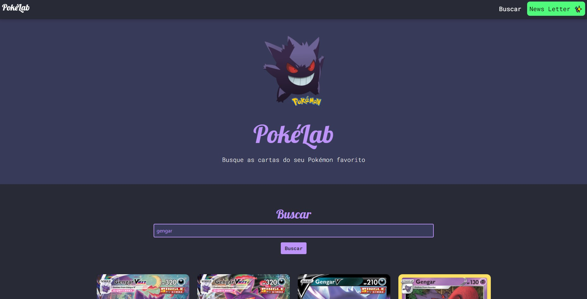

# PokéLab

> Pesquise as cartas do seu Pokémon favorito!

## Techs

- HTML
- CSS
- JavaScript
- Bootstrap

## Docs API

- [Pokemon TCG](https://docs.pokemontcg.io/)

## Install

1. Clonar repo
2. Acessar pasta do projeto
3. Acessar `index.html`
4. Dentro do [VSCODE](https://code.visualstudio.com/) com extensão [Live Server](https://marketplace.visualstudio.com/items?itemName=ritwickdey.LiveServer) já instalada, clicar em Open Live
5. Enjoy

